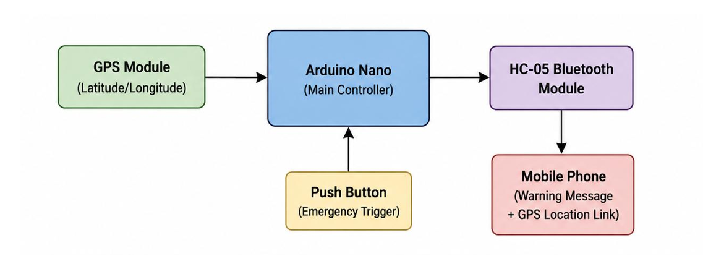
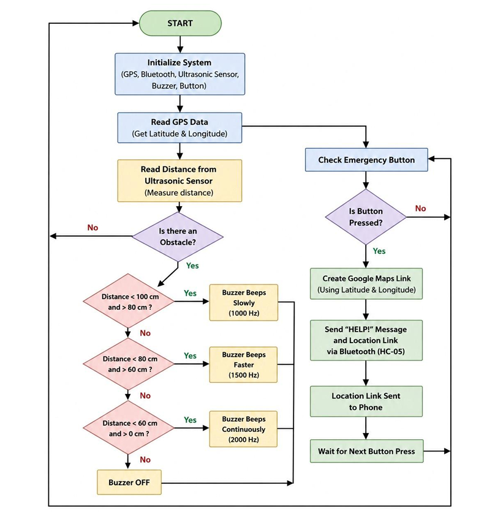
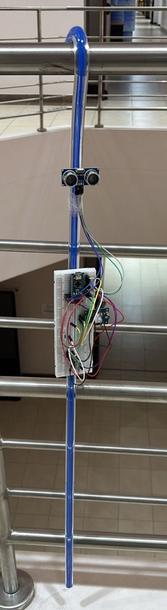

# Blind Assistive IoT Cane (Smart Cane System)

##  Motivation & Humanitarian Impact
Independence is one of the greatest challenges faced by visually impaired individuals in their daily lives. Traditional white canes, while useful, cannot detect obstacles above ground level or provide real-time remote assistance during emergencies. 

This project was born out of a humanitarian vision: to leverage modern IoT technology to enhance mobility, ensure safety, and give visually impaired individuals the confidence to navigate the world independently. By combining obstacle detection with immediate location-sharing capabilities, this Smart Cane acts as a reliable companion, bridging the gap between technology and human empathy.

---

An IoT-based Smart Cane system designed to assist visually impaired individuals in navigating their surroundings safely. The project integrates obstacle detection, auditory feedback, and a one-touch emergency location tracking system.

---

##  Hardware Components
* Microcontroller: Arduino Compatible Board
* Distance Sensor: HC-SR04 Ultrasonic Sensor (Obstacle Detection)
* Audio Feedback: Active Buzzer (Proximity Alerts)
* Wireless Communication: HC-05 Bluetooth Module (Data Streaming)
* Location Tracking: NEO-6M GPS Module (NMEA Parsing)
* Input Device: Emergency Push Button (Tactile Switch)

---

##  Features & Architecture

### 1. Obstacle Detection & Auditory Feedback
The system continuously measures distance using the Ultrasonic sensor (`TRIG: Pin 2`, `ECHO: Pin 3`). It provides dynamic auditory feedback via the buzzer (`Pin 4`) based on proximity zones:
* Critical Zone (0 - 30 cm): High-frequency urgent alerts.
* Warning Zone (30 - 70 cm): Moderate frequency tones.
* Safe Zone (> 70 cm): Buzzer remains idle.

### 2. GPS Tracking & NMEA Parsing
The NEO-6M GPS module is connected via Software Serial (`TX: Pin 6`, RX: Pin 7`). The system listens continuously to raw NMEA sentences, specifically isolating `$GPRMC strings to convert raw coordinate formats into standard 6-decimal point precision latitude and longitude values.

### 3. Emergency Push Button Polling
A physical push button (`Pin 5`) utilizes the microcontroller's internal pull-up resistor. When the button is pressed (State transition from HIGH to `LOW`), it instantly triggers the emergency subroutine to stream the exact real-time coordinates over the Bluetooth TX buffer.

---

##  System Diagrams & Prototype

### 1. System Block Diagram

### 2. Project Flowchart

### 3. Hardware Prototype Layout

---

##  Getting Started

### Pin Mapping Reference
| Component | Arduino Pin | Mode |
| --- | --- | --- |
| TRIG (Ultrasonic) | Pin 2 | OUTPUT |
| ECHO (Ultrasonic) | Pin 3 | INPUT |
| BUZZER | Pin 4 | OUTPUT |
| BUTTON | Pin 5 | INPUT_PULLUP |
| TX_GPS (Software Serial) | Pin 6 | INPUT (Receives from GPS TX) |
| RX_GPS (Software Serial) | Pin 7 | OUTPUT (Connects to GPS RX) |

### How to Flash the Firmware
1. Open Smart_Cane_Code.ino using the Arduino IDE.
2. Ensure the SoftwareSerial library is available (built-in by default).
3. Select your board type and the correct COM port.
4. Click Verify to compile, then Upload to flash the code onto the microcontroller.

---
*Developed as a collaborative course project.*
